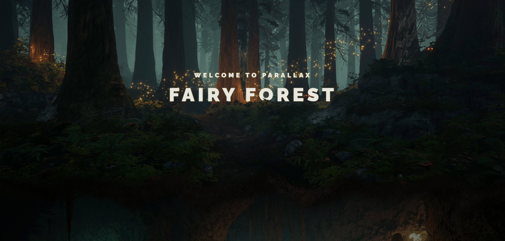

# Wonder_Forest with Parallax effect

Beautiful adaptive website with special features:
* parallax effect of moving layers 
* smooth scroll (gsap libs)
* luminous title
* animation cubic bezier

## Technologies:

## Result:

<a href="https://rasalila.github.io/wonder_forest/">View here</a>